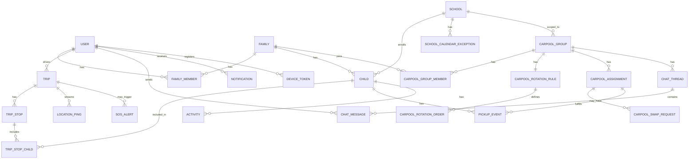

# Database Schema — School Pickup Coordinator

PostgreSQL. Types written as Django field types for direct translation into models.

## Entity Relationship Overview

---

## 1. `users`
Mirrors Clerk users locally so we can FK against them. Kept in sync primarily via Clerk webhooks (`user.created`, `user.updated`, `user.deleted`); JIT-provisioning on first authenticated request is a fallback for the gap before the first webhook fires.

| Field | Type | Notes |
|---|---|---|
| id | UUID (PK) | internal PK, generated locally — do not reuse Clerk's id format directly |
| clerk_user_id | CharField, unique, indexed | Clerk's user id, i.e. the JWT `sub` claim |
| email | EmailField, unique | synced from Clerk |
| phone | CharField, nullable | synced from Clerk |
| full_name | CharField | |
| avatar_url | URLField, nullable | Cloudinary URL — Clerk also hosts a profile image, but keep our own so it flows through the same media pipeline as child photos/chat attachments |
| created_at | DateTimeField | |
| updated_at | DateTimeField | |

## 2. `families`
| Field | Type | Notes |
|---|---|---|
| id | UUID (PK) | |
| name | CharField | e.g. "The Garcia Family" |
| created_by | FK → users | |
| created_at | DateTimeField | |

## 3. `family_members`
| Field | Type | Notes |
|---|---|---|
| id | UUID (PK) | |
| family | FK → families | |
| user | FK → users | |
| role | CharField, choices: `owner`, `member` | |
| joined_at | DateTimeField | |
| *unique_together* | (family, user) | |

## 4. `schools`
| Field | Type | Notes |
|---|---|---|
| id | UUID (PK) | |
| name | CharField | |
| address | CharField | |
| lat | DecimalField | |
| lng | DecimalField | |
| timezone | CharField | IANA tz, e.g. `America/Chicago` |
| default_dismissal_time | TimeField | weekday default; can be overridden per exception |
| early_dismissal_days | JSONField, nullable | e.g. list of weekday ints with a different time |
| phone | CharField, nullable | |
| created_at | DateTimeField | |

## 5. `school_calendar_exceptions`
| Field | Type | Notes |
|---|---|---|
| id | UUID (PK) | |
| school | FK → schools | |
| date | DateField | |
| dismissal_time | TimeField, nullable | null = "no school that day" |
| reason | CharField | e.g. "Early dismissal", "Holiday" |
| created_at | DateTimeField | |
| *unique_together* | (school, date) | |

## 6. `children`
| Field | Type | Notes |
|---|---|---|
| id | UUID (PK) | |
| family | FK → families | |
| school | FK → schools, nullable | nullable to allow adding a child before assigning school |
| full_name | CharField | |
| date_of_birth | DateField, nullable | |
| grade | CharField, nullable | |
| photo_url | URLField, nullable | Cloudinary |
| color_tag | CharField, nullable | hex color for calendar/map UI |
| notes | TextField, nullable | allergies, medical notes, etc. |
| created_at | DateTimeField | |

## 7. `activities`
Recurring after-school activities that affect pickup planning.

| Field | Type | Notes |
|---|---|---|
| id | UUID (PK) | |
| child | FK → children | |
| name | CharField | e.g. "Soccer practice" |
| day_of_week | IntegerField (0–6) | |
| start_time | TimeField | |
| end_time | TimeField | |
| location_name | CharField | |
| location_lat | DecimalField, nullable | |
| location_lng | DecimalField, nullable | |
| created_at | DateTimeField | |

## 8. `carpool_groups`
| Field | Type | Notes |
|---|---|---|
| id | UUID (PK) | |
| school | FK → schools | |
| name | CharField | |
| invite_code | CharField, unique | for joining |
| created_by | FK → users | |
| created_at | DateTimeField | |

## 9. `carpool_group_members`
| Field | Type | Notes |
|---|---|---|
| id | UUID (PK) | |
| carpool_group | FK → carpool_groups | |
| family | FK → families | |
| role | CharField, choices: `admin`, `member` | |
| joined_at | DateTimeField | |
| *unique_together* | (carpool_group, family) | |

## 10. `carpool_rotation_rules`
One active rule per group defining how auto-suggestions are generated.

| Field | Type | Notes |
|---|---|---|
| id | UUID (PK) | |
| carpool_group | FK → carpool_groups, one-to-one | |
| rotation_type | CharField, choices: `round_robin`, `weighted`, `manual_only` | |
| cycle_days | JSONField | which weekdays this rotation applies to, e.g. `[0,1,2,3,4]` |
| start_date | DateField | anchor date for the rotation order |
| created_at | DateTimeField | |
| updated_at | DateTimeField | |

## 11. `carpool_rotation_order`
Ordered list of families in the rotation.

| Field | Type | Notes |
|---|---|---|
| id | UUID (PK) | |
| rotation_rule | FK → carpool_rotation_rules | |
| family | FK → families | |
| position | IntegerField | order in the rotation |
| weight | IntegerField, default 1 | for `weighted` rotation type (more turns) |
| *unique_together* | (rotation_rule, position) | |

## 12. `carpool_assignments`
Concrete date-based driving assignment — the output of the rotation engine, editable by humans.

| Field | Type | Notes |
|---|---|---|
| id | UUID (PK) | |
| carpool_group | FK → carpool_groups | |
| date | DateField | |
| driver_family | FK → families | |
| driver_user | FK → users, nullable | specific person, set once confirmed |
| status | CharField, choices: `suggested`, `confirmed`, `swap_pending`, `completed`, `cancelled` | |
| is_auto_suggested | BooleanField, default False | |
| notes | TextField, nullable | |
| created_at | DateTimeField | |
| updated_at | DateTimeField | |
| *unique_together* | (carpool_group, date) | |

## 13. `carpool_swap_requests`
| Field | Type | Notes |
|---|---|---|
| id | UUID (PK) | |
| assignment | FK → carpool_assignments | |
| requested_by | FK → users | |
| target_family | FK → families | who's being asked to cover |
| status | CharField, choices: `pending`, `accepted`, `rejected`, `expired` | |
| reason | TextField, nullable | |
| created_at | DateTimeField | |
| resolved_at | DateTimeField, nullable | |

## 14. `trips`
A driver's real-time run for a day, may cover multiple stops/kids.

| Field | Type | Notes |
|---|---|---|
| id | UUID (PK) | |
| driver | FK → users | |
| carpool_group | FK → carpool_groups, nullable | null if it's a solo parent pickup, not a carpool run |
| date | DateField | |
| status | CharField, choices: `not_started`, `in_progress`, `completed`, `cancelled` | |
| started_at | DateTimeField, nullable | |
| ended_at | DateTimeField, nullable | |
| tracking_mode | CharField, choices: `live_gps`, `status_only` | driver's choice for this trip |
| created_at | DateTimeField | |

## 15. `trip_stops`
| Field | Type | Notes |
|---|---|---|
| id | UUID (PK) | |
| trip | FK → trips | |
| school | FK → schools, nullable | nullable to support activity pickups |
| activity | FK → activities, nullable | |
| sequence_order | IntegerField | |
| eta | DateTimeField, nullable | recalculated periodically |
| status | CharField, choices: `pending`, `en_route`, `arrived`, `picked_up`, `skipped` | |
| actual_arrival_time | DateTimeField, nullable | |

## 16. `trip_stop_children`
| Field | Type | Notes |
|---|---|---|
| id | UUID (PK) | |
| trip_stop | FK → trip_stops | |
| child | FK → children | |
| picked_up_at | DateTimeField, nullable | |
| *unique_together* | (trip_stop, child) | |

## 17. `location_pings`
High-volume, short-retention (purged nightly beyond ~30 days).

| Field | Type | Notes |
|---|---|---|
| id | BigAutoField (PK) | plain autoincrement — UUID overkill for this volume |
| trip | FK → trips, indexed | |
| lat | DecimalField | |
| lng | DecimalField | |
| speed | FloatField, nullable | |
| heading | FloatField, nullable | |
| recorded_at | DateTimeField, indexed | |

## 18. `pickup_events`
Daily record of how each child actually gets home — the thing the "Today" screen renders per child.

| Field | Type | Notes |
|---|---|---|
| id | UUID (PK) | |
| child | FK → children | |
| date | DateField | |
| pickup_method | CharField, choices: `parent`, `carpool`, `aftercare`, `bus`, `walker` | |
| carpool_assignment | FK → carpool_assignments, nullable | set if `pickup_method='carpool'` |
| trip_stop_child | FK → trip_stop_children, nullable | links to live tracking once a trip starts |
| status | CharField, choices: `scheduled`, `en_route`, `arrived`, `picked_up`, `missed`, `cancelled` | |
| scheduled_time | DateTimeField | resolved dismissal/activity end time for that day |
| created_at | DateTimeField | |
| *unique_together* | (child, date) | one row per child per day |

## 19. `chat_threads`
| Field | Type | Notes |
|---|---|---|
| id | UUID (PK) | |
| carpool_group | FK → carpool_groups, nullable | |
| context_type | CharField, choices: `carpool_group`, `trip` | |
| trip | FK → trips, nullable | for a "today's run" thread |
| created_at | DateTimeField | |

## 20. `chat_messages`
| Field | Type | Notes |
|---|---|---|
| id | UUID (PK) | |
| thread | FK → chat_threads, indexed | |
| sender | FK → users | |
| content | TextField, nullable | |
| attachment_url | URLField, nullable | Cloudinary |
| message_type | CharField, choices: `text`, `image`, `system` | |
| created_at | DateTimeField, indexed | |

## 21. `chat_read_receipts`
| Field | Type | Notes |
|---|---|---|
| id | UUID (PK) | |
| message | FK → chat_messages | |
| user | FK → users | |
| read_at | DateTimeField | |
| *unique_together* | (message, user) | |

## 22. `notifications`
| Field | Type | Notes |
|---|---|---|
| id | UUID (PK) | |
| user | FK → users, indexed | |
| type | CharField, choices: `pickup_reminder`, `driver_arrived`, `swap_request`, `chat_message`, `schedule_change`, `sos` | |
| title | CharField | |
| body | TextField | |
| data | JSONField, nullable | deep-link payload |
| is_read | BooleanField, default False | |
| created_at | DateTimeField, indexed | |

## 23. `notification_preferences`
| Field | Type | Notes |
|---|---|---|
| id | UUID (PK) | |
| user | FK → users | |
| notification_type | CharField | matches `notifications.type` choices |
| push_enabled | BooleanField, default True | |
| sms_enabled | BooleanField, default False | |
| email_enabled | BooleanField, default False | |
| *unique_together* | (user, notification_type) | |

## 24. `device_tokens`
| Field | Type | Notes |
|---|---|---|
| id | UUID (PK) | |
| user | FK → users | |
| token | CharField, unique | Expo push token |
| platform | CharField, choices: `ios`, `android` | |
| created_at | DateTimeField | |

## 25. `sos_alerts`
| Field | Type | Notes |
|---|---|---|
| id | UUID (PK) | |
| trip | FK → trips, nullable | |
| raised_by | FK → users | |
| lat | DecimalField, nullable | |
| lng | DecimalField, nullable | |
| message | TextField, nullable | |
| status | CharField, choices: `active`, `resolved` | |
| created_at | DateTimeField | |
| resolved_at | DateTimeField, nullable | |
| resolved_by | FK → users, nullable | |

---

## Indexing Notes

- `location_pings(trip, recorded_at)` — composite index, this table is write-heavy and queried by "latest ping for trip."
- `chat_messages(thread, created_at)` — for paginated history.
- `pickup_events(date)` and `pickup_events(child, date)` — the "Today" view and history views hit this constantly.
- `carpool_assignments(carpool_group, date)` — already unique together, doubles as the lookup index for calendar views.

## Cascade Behavior Notes

- Deleting a `family` should cascade to `family_members` and `children`, but you likely want `carpool_group_members` to soft-remove rather than hard-delete (preserve history in `carpool_assignments`).
- `location_pings` should cascade-delete with their `trip` — no value in orphaned pings.
- Consider soft-delete (`is_active` flag) rather than hard-delete on `children` and `schools`, since `pickup_events` history references them and you don't want to lose a season's pickup history because a kid graduated.
