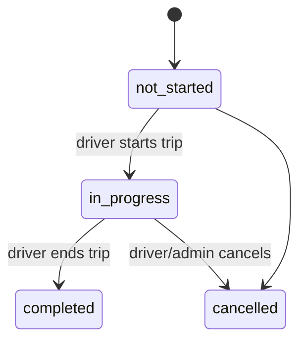
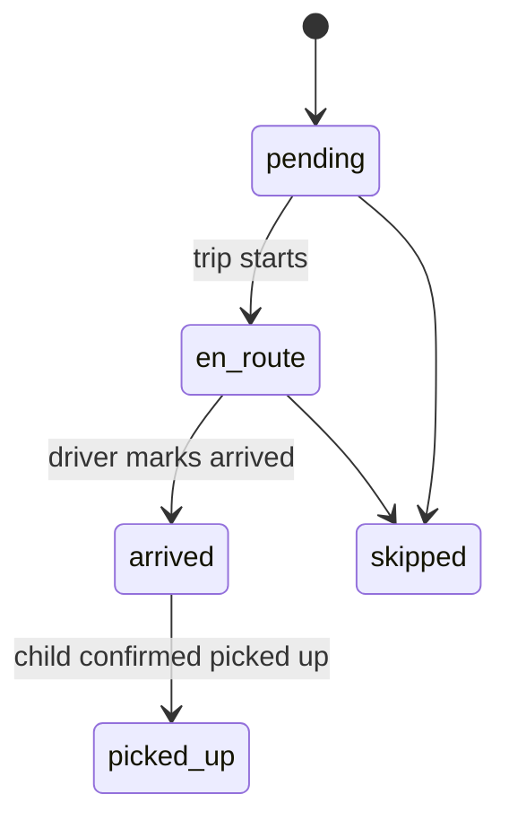
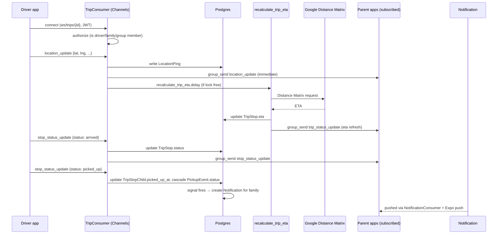

# Systems Deep Dive — Celery, Channels, Rotation Engine, Trip Tracking

## 1. Celery — Task Design

Per-school dismissal times make static Celery Beat entries a poor fit (you'd need one beat schedule per school, updated whenever a school is added). Instead, use a single **poller** pattern: one beat task runs frequently and fans out.

| Task | Schedule | Idempotency / Retry |
|---|---|---|
| `poll_upcoming_dismissals` | beat, every 5 min | Queries `School`/`SchoolCalendarException` for dismissals landing in the next `reminder_offset` window; for each hit, dispatches `send_dismissal_reminder.delay(child_id, date)` — one per child, not per school, since reminder recipients differ per family |
| `send_dismissal_reminder(child_id, date)` | dispatched above | Checks a `sent` marker (e.g. a unique constraint on `(notification_type, child_id, date)` in `notifications` via `get_or_create`) before sending — safe to re-dispatch |
| `generate_carpool_suggestions(carpool_group_id, date_from, date_to)` | on-demand (API call) or nightly beat for the coming week | Naturally idempotent — see rotation engine section; never overwrites an existing `CarpoolAssignment` row for a date |
| `recalculate_trip_eta(trip_id)` | dispatched from the location-ping consumer, throttled | Redis lock key `eta_lock:{trip_id}` with a 30s TTL — if the lock is held, skip (a fresher ping will trigger the next one anyway). `autoretry_for=(RequestException,)`, `retry_backoff=True`, `max_retries=3` for the Maps API call |
| `send_push_notification(notification_id)` | dispatched from signals on `Notification.save()` | Checks/sets a `delivered_at` timestamp before calling Expo's push API — retries won't double-send |
| `expire_stale_swap_requests` | beat, hourly | Bulk `.filter(status='pending', created_at__lt=cutoff).update(status='expired')` — naturally idempotent |
| `cleanup_old_location_pings` | beat, nightly | Deletes in batches (`LIMIT`-based loop, e.g. 5k rows at a time) to avoid long table locks on a high-volume table |

**Why throttle ETA recalculation via Redis lock rather than Celery's own rate limits:** Celery's `rate_limit` is per-task-global, not per-trip. You want "at most once every 30s **per trip**," which needs a keyed lock, not a global throttle.

## 2. Django Channels — Consumer Design

**Auth**: a custom ASGI middleware (`JWTAuthMiddleware`, wrapping `AuthMiddlewareStack`) pulls the token from the WS query string, runs it through the same verification function the DRF authentication class uses, and sets `scope["user"]`. Reject the connection (`close(code=4001)`) before `group_add` if verification fails.

| Consumer | Group | Accepts from client | Broadcasts |
|---|---|---|---|
| `TripConsumer` | `trip_{trip_id}` | `location_update` (driver only — reject if `scope.user != trip.driver`), `stop_status_update` | `location_update`, `stop_status_update`, `trip_status_update` |
| `ChatConsumer` | `chat_{thread_id}` | `message.send`, `message.read` | `message.new`, `message.read` |
| `NotificationConsumer` | `user_{user_id}` | none (read-only stream) | `notification.new` — pushed by a signal on `Notification.save()`, not by consumer logic |

**Connect-time authorization** (checked before `group_add`, not just at the HTTP layer):
- `TripConsumer`: user is the trip's driver, OR a member of a family with a child in one of the trip's stops, OR a member of the trip's carpool group.
- `ChatConsumer`: user's family is a member of the thread's carpool group (or party to the thread's trip).

**Write path**: incoming `location_update` → `database_sync_to_async` write to `LocationPing` → check the ETA Redis lock → conditionally `recalculate_trip_eta.delay(trip_id)` → `group_send` the raw ping to `trip_{trip_id}` immediately (don't wait on the ETA task — position updates should feel instant; ETA lags slightly behind, which is fine).

**Scaling note**: `channels_redis` as the layer backend is fine at this scale. If it ever becomes a bottleneck, the first lever is sharding groups across multiple Redis instances — not a rewrite, just a config change.

## 3. Rotation Engine — Algorithm

**Inputs**: `CarpoolRotationRule` (type, `cycle_days`, `start_date`), ordered `CarpoolRotationOrder` rows (family, position, weight), and a date range to fill.

**Core rule: generation only fills gaps, never overwrites.** Any date that already has a `CarpoolAssignment` (manually created, swapped, or previously generated) is left untouched. This is what makes `generate_carpool_suggestions` safe to re-run on a schedule or on demand.

```
function generate(rule, order_list, date_from, date_to):
    expanded_sequence = []
    for entry in order_list (sorted by position):
        expanded_sequence.extend([entry.family] * entry.weight)
    # e.g. weights [2,1,1] over families [A,B,C] → [A,A,B,C], cycle length 4

    applicable_dates = [
        d for d in daterange(date_from, date_to)
        if d.weekday() in rule.cycle_days
        and school_is_in_session(school, d)   # checks SchoolCalendarException
    ]

    slot_number = count_applicable_dates_since(rule.start_date, up_to=date_from_start_of_range)

    created = []
    for date in applicable_dates:
        if CarpoolAssignment.objects.filter(carpool_group, date=date).exists():
            slot_number += 1
            continue  # never overwrite

        family = expanded_sequence[slot_number % len(expanded_sequence)]
        created.append(CarpoolAssignment.objects.create(
            carpool_group=rule.carpool_group,
            date=date,
            driver_family=family,
            status='suggested',
            is_auto_suggested=True,
        ))
        slot_number += 1

    return created
```

**Why weight-by-repetition instead of a smarter weighted-fair algorithm**: a repeated-position expansion (like `[A,A,B,C]`) is simple, fully deterministic, and easy for a parent to eyeball and understand ("A drives twice as often as B or C"). A smoother distribution algorithm (e.g. surplus round robin) is a legitimate v2 upgrade if families complain about clustering (e.g. A driving two days in a row), but isn't worth the complexity for v1.

**Swaps don't touch the rotation order.** Accepting a `CarpoolSwapRequest` only updates that single `CarpoolAssignment.driver_family`/`driver_user` — it's a point-in-time exception layered on top of the deterministic sequence, not a permanent reordering. This means one swap never cascades into shifting every future assignment, which is the behavior parents actually want ("just this Tuesday," not "swap my whole spot in the rotation").

**Manual edits work the same way** — a `PATCH` on an assignment creates/overwrites that one row; future `generate` calls skip it because it already exists.

**Known gap to flag, not solve automatically**: if a family leaves the carpool group mid-rotation, their `CarpoolRotationOrder` row needs manual resequencing by an admin (a `POST /carpool-groups/{id}/rotation-rule/reorder/` endpoint that takes a new position ordering is worth adding in Stage 3 — cleaner than auto-compacting positions, which could silently change who's "up next" without anyone noticing).

## 4. Trip / Tracking Lifecycle





**Sequence — a single stop, end to end:**



**Cascade detail worth calling out explicitly**: `TripStopChild.picked_up_at` being set is the trigger — a Django signal (`post_save`) on that model updates the linked `PickupEvent.status` to `picked_up`, which in turn creates a `Notification` for every member of that child's family. Keeping this as a signal chain (rather than the consumer directly writing to three tables) keeps the consumer thin and the cascade logic testable in isolation.
